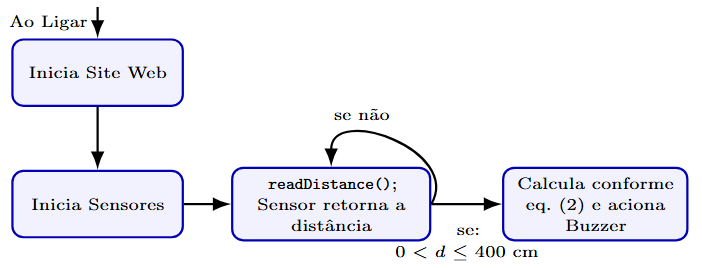

<div align="center">

<pre>
  ███████╗ ██████╗ ██╗   ██╗███╗   ██╗██████╗ 
  ██╔════╝██╔═══██╗██║   ██║████╗  ██║██╔══██╗
  ███████╗██║   ██║██║   ██║██╔██╗ ██║██║  ██║
  ╚════██║██║   ██║██║   ██║██║╚██╗██║██║  ██║
  ███████║╚██████╔╝╚██████╔╝██║ ╚████║██████╔╝
  ╚══════╝ ╚═════╝  ╚═════╝ ╚═╝  ╚═══╝╚═════╝ 
  ██╗   ██╗██╗███████╗██╗ ██████╗ ███╗   ██╗
  ██║   ██║██║██╔════╝██║██╔═══██╗████╗  ██║
  ██║   ██║██║███████╗██║██║   ██║██╔██╗ ██║
  ╚██╗ ██╔╝██║╚════██║██║██║   ██║██║╚██╗██║
   ╚████╔╝ ██║███████║██║╚██████╔╝██║ ╚████║
    ╚═══╝  ╚═╝╚══════╝╚═╝ ╚═════╝ ╚═╝  ╚═══╝
</pre>

<p><b>Low-Cost Wearable Assistive Device · Tri-Directional Sensing · IoT Enabled</b></p>


</div>

---

## What is SoundVision?

**SoundVision** is an open-source, low-cost wearable assistive technology designed to aid the mobility of visually impaired individuals. It also serves as a robust pedagogical platform for Project-Based Learning (PBL) in engineering education.

Stop relying on single-sensor solutions with massive blind spots. SoundVision uses a tri-directional array of ultrasonic sensors mounted on eyeglass frames to provide comprehensive frontal and lateral spatial awareness.

```text
Obstacle → SoundVision (Sensors + ESP32) → Spatial Auditory Feedback
```

Designed to be accessible (under US$ 30 BOM), replicable, and highly effective for both end-users and engineering students.

## How it Works

SoundVision utilizes a non-blocking Finite State Machine (FSM) to ensure real-time performance with a deterministic latency of ~56 ms:

<div align="center">
  
  <p><i>System Architecture and Data Flow</i></p>
</div>

## Features

*   **Tri-Directional Array** — Eliminates lateral blind spots using three independent ultrasonic zones.
*   **Real-Time Processing** — Custom FSM architecture ensures ~56ms cycle time (17.8 Hz) for instant feedback.
*   **Spatial Auditory Feedback** — Distinct tonal frequencies for each direction (Left, Center, Right) allow intuitive navigation without headphones.
*   **IoT Telemetry Dashboard** — Built-in Wi-Fi Access Point hosts a real-time WebSocket dashboard to monitor sensor states and configure parameters.
*   **Extremely Low Cost** — Total Bill of Materials (BOM) under US$ 30, making it ideal for large-scale academic replication.
*   **Wearable & Ergonomic** — Lightweight PLA 3D-printed structure designed to attach to standard eyeglass frames.

## Tech Stack

| Component | Technology |
|---|---|
| **Microcontroller** | ESP32-C3 Mini (RISC-V 32-bit) |
| **Sensors** | 3x HC-SR04 Ultrasonic Transducers |
| **Firmware** | C++ (ESP-IDF / Arduino Core) |
| **IoT Dashboard** | HTML, Vanilla JS, WebSockets |
| **Power** | 1000mAh LiPo + TP4056 Charging Module |
| **Structure** | 3D Printed PLA |

## Assembly & Deployment

**SoundVision** is optimized for quick academic deployment and experimentation.

```bash
# To clone the firmware and upload via PlatformIO or Arduino IDE:
git clone https://github.com/theHerick/soundvision.git
cd soundvision/firmware
```

**Hardware Requirements:**
- 1x ESP32-C3 Mini
- 3x HC-SR04
- 3x Piezoelectric Buzzers
- 1x TP4056 Module + 3.7V LiPo Battery
- Standard 3D Printer for the `.stl` frame files.

## Project Structure

```text
soundvision/
├── firmware/           # C++ Source code for ESP32-C3 (FSM + WebSockets)
├── hardware/
│   ├── schematics/     # Circuit diagrams and wiring
│   └── 3d_models/      # .STL files for the 3D printed eyeglass frame
├── docs/               # Pedagogical guides and PBL lesson plans
└── README.md           # Project overview
```

<div align="center">
Made with 💡 for Engineering Education and Social Impact.
<br>
Tiburski, H. B. | Alves, M. D. C. | Sausen, J. P. | de Campos, M.
</div>
