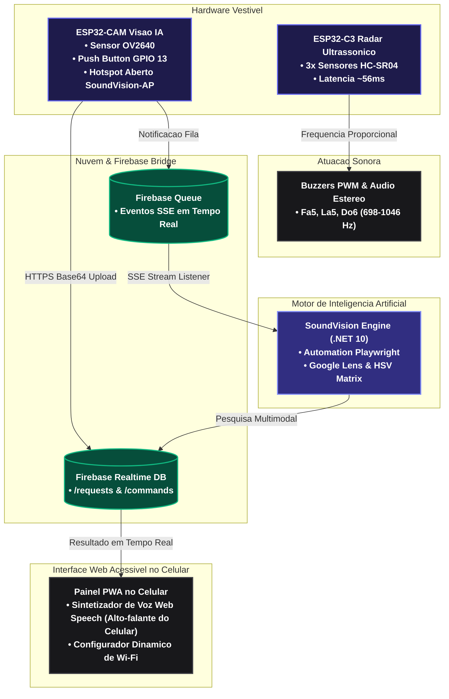

# SoundVision - Firmware de Tecnologia Assistiva Ultrassônica (ESP32-C3) & Visão Computacional IA

Este repositório contém o sistema completo do dispositivo vestível **SoundVision**, desenvolvido para auxílio à mobilidade de pessoas com deficiência visual e utilizado como plataforma pedagógica baseada em **Aprendizagem Baseada em Projetos (PBL)** no ensino de engenharia (Artigo publicado no **CBA 2026**).

---

## Visão Geral do Sistema

O firmware é implementado em arquivos de código fonte compatíveis com o **Arduino IDE** (ESP32 Core v2.x e v3.x+). Ele integra:

1. **Dualidade Pedagógica / Acessibilidade**:
   - **Visor do Estudante / Educador**: Exibe o radar espacial em tempo real, rastro de obstáculos, telemetria em centímetros e latência determinística em tempo real (~56 ms).
   - **Painel do Usuário (Deficiente Visual)**: Botões gigantes de alto contraste tátil com suporte à voz ao clicar (**Web Speech API pelo Celular**), que lê em voz alta o botão ou ajuste tocado usando o próprio alto-falante do smartphone.
2. **Botões Gigantes e Acessíveis**:
   - `BUZZERS DA PLACA: ATIVADOS / DESATIVADOS` (Botão gigante de alto contraste).
   - `MODO HEADPHONE: ATIVADO / DESATIVADO` (Áudio espacial estéreo via Web Audio API do celular).
   - `VOZ AO CLICAR: ATIVADO / DESATIVADO` (Lê em voz alta o botão tocado pelo alto-falante do celular).
   - **Botões Grandes de Passo (`+` / `-`)** para ajuste tátil da distância máxima individual ($d_{max}$) de cada sensor (mínima fixa em 0 cm).
3. **Bloqueio de Zoom**: Desativado via `user-scalable=no` e `touch-action: manipulation`.
4. **Zero Bibliotecas Externas**: Utiliza apenas `<WiFi.h>` e `<WebServer.h>` nativos do ESP32 no firmware ultrassônico.


```mermaid
graph TD
    classDef hardware fill:#1e1b4b,stroke:#6366f1,stroke-width:2px,color:#fff,font-weight:bold;
    classDef cloud fill:#064e3b,stroke:#10b981,stroke-width:2px,color:#fff,font-weight:bold;
    classDef engine fill:#312e81,stroke:#818cf8,stroke-width:2px,color:#fff,font-weight:bold;
    classDef output fill:#18181b,stroke:#3f3f46,stroke-width:2px,color:#fff,font-weight:bold;

    subgraph Assistive_Hardware ["Hardware Vestivel"]
        C3["ESP32-C3 Radar Ultrassonico<br/>• 3x Sensores HC-SR04<br/>• Latencia ~56ms"]:::hardware
        CAM["ESP32-CAM Visao IA<br/>• Sensor OV2640<br/>• Push Button GPIO 13<br/>• Hotspot Aberto SoundVision-AP"]:::hardware
    end

    subgraph Audio_Feedback ["Atuacao Sonora"]
        BUZZER["Buzzers PWM & Audio Estereo<br/>• Fa5, La5, Do6 (698-1046 Hz)"]:::output
    end

    subgraph Cloud_Bridge ["Nuvem & Firebase Bridge"]
        FB_REQ[("Firebase Realtime DB<br/>• /requests & /commands")]:::cloud
        FB_QUEUE[("Firebase Queue<br/>• Eventos SSE em Tempo Real")]:::cloud
    end

    subgraph AI_Engine ["Motor de Inteligencia Artificial"]
        PLAYWRIGHT["SoundVision Engine (.NET 10)<br/>• Automation Playwright<br/>• Google Lens & HSV Matrix"]:::engine
    end

    subgraph Web_Interface ["Interface Web Acessivel no Celular"]
        WEB["Painel PWA no Celular<br/>• Sintetizador de Voz Web Speech (Alto-falante do Celular)<br/>• Configurador Dinamico de Wi-Fi"]:::output
    end

    C3 -- "Frequencia Proporcional" --> BUZZER
    CAM -- "HTTPS Base64 Upload" --> FB_REQ
    CAM -- "Notificacao Fila" --> FB_QUEUE
    FB_QUEUE -- "SSE Stream Listener" --> PLAYWRIGHT
    PLAYWRIGHT -- "Pesquisa Multimodal" --> FB_REQ
    FB_REQ -- "Resultado em Tempo Real" --> WEB
```

---

## Esquema de Pinagem Hardware Final (ESP32-C3)

| Componente | Função | Pino GPIO (ESP32-C3) | Frequência Audio / Nota |
| :--- | :--- | :--- | :--- |
| **HC-SR04 (Esquerda)** | TRIG / ECHO | GPIO 2 / GPIO 1 | - |
| **HC-SR04 (Frente)** | TRIG / ECHO | GPIO 4 / GPIO 3 | - |
| **HC-SR04 (Direita)** | TRIG / ECHO | GPIO 5 / GPIO 6 | - |
| **Buzzer Esquerdo** | PWM Audio | GPIO 7 | 698 Hz (Fá5 - Suave) |
| **Buzzer Frontal** | PWM Audio | GPIO 0 | 880 Hz (Lá5 - Padrão) |
| **Buzzer Direito** | PWM Audio | GPIO 8 | 1046 Hz (Dó6 - Suave) |

### Esquema de Pinagem ESP32-CAM (Visão IA)
| Componente | Função | Pino GPIO | Tensão / Modo |
| :--- | :--- | :--- | :--- |
| **Push Button Físico** | Disparo Instantâneo | GPIO 13 | INPUT_PULLUP (GND) |
| **PWDN** | Hardware Camera Reset | GPIO 32 | 3.3V (HIGH / LOW) |
| **Status LED** | Indicador de Captura | GPIO 33 | OUTPUT (Lógica Inversa) |
| **Sensor OV2640** | Captura JPEG (640x480) | Pinos PCLK/VSYNC/HREF | 3.3V |

---

## Equações Implementadas no Firmware

1. **Estimativa da Distância Ultrassônica (Eq. 1)**:
   $$d = \frac{v_{som} \cdot \Delta t}{2} \quad \text{onde } v_{som} = 0,0343 \text{ cm/}\mu\text{s}$$

2. **Intervalo do Pulso Sonoro ($T_{pulso}$)**:
   $$T_{pulso\_i} = d_{med\_i} \cdot 10\text{ ms} \quad (\text{Mínima } d_{min} = 0\text{ cm})$$

3. **Latência Determinística de Tempo Real (Eq. 3)**:
   $$T_{ciclo} = T_{aquisição} + T_{processamento} + T_{atuação} \approx 56\text{ ms} \quad (17,8\text{ Hz})$$

---

## Estrutura do Repositório

```text
SoundVision/
├── firmware/
│   ├── esp32c3_ultrasonic/
│   │   └── esp32c3_ultrasonic.ino     # Firmware ESP32-C3 (Radar Ultrassônico & Buzzers)
│   └── esp32cam_vision/
│       └── esp32cam_vision.ino        # Firmware ESP32-CAM (Visão, Wi-Fi NVS & Push Button GPIO 13)
├── vision_engine/                      # Motor C# .NET WPF com IA do Google Lens & Color Classifier
│   ├── SoundVisionEngine.csproj
│   ├── appsettings.json
│   └── ...
├── web/
│   └── index.html                     # Painel Web PWA Acessível no Celular (Configurador Wi-Fi, Botão & Voz no Celular)
├── iniciar_soundvision.bat             # Script de 1-Clique para rodar o motor de IA
├── LICENSE                             # Licença MIT Oficial
└── README.md                           # Documentação Completa do Projeto
```

---

## Configuração e Execução

### 1. Gravação do Firmware
- Abra `firmware/esp32c3_ultrasonic/esp32c3_ultrasonic.ino` no Arduino IDE e grave na placa **ESP32-C3**.
- Abra `firmware/esp32cam_vision/esp32cam_vision.ino` no Arduino IDE e grave na placa **AI Thinker ESP32-CAM**.

### 2. Executar o Motor de Inteligência Artificial
Execute o inicializador de 1-clique no Windows:
```cmd
iniciar_soundvision.bat
```

### 3. Painel Web no Celular, Push Button e Voz pelo Celular
- **Leitura em Voz Alta pelo Celular**: Quando a página `web/index.html` estiver aberta no seu smartphone (conectado ao Wi-Fi ou Vercel), ela usa o **alto-falante nativo do seu celular** para falar a descrição do objeto reconhecido!
- **Push Button Físico**: Conecte um botão simples entre o **GPIO 13** e o **GND** da ESP32-CAM. Ao apertar o botão, a câmera captura a foto e o seu celular fala o resultado imediatamente.
- **Troca Dinâmica de Wi-Fi**: Preencha o nome da rede (SSID) e senha na seção **Configurar Wi-Fi da ESP32-CAM** do site no celular. A ESP32-CAM salvará os dados na memória NVS e se conectará à Internet.

---

## Licença

Este projeto é software livre licenciado sob a **Licença MIT** (consulte o arquivo `LICENSE` no repositório). Desenvolvido para auxílio de pessoas com deficiência visual e apresentado no **CBA 2026**.
